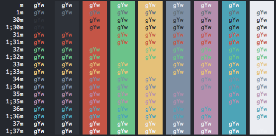

#unofficial Neutron Color Scheme for iTerm 2#

##About##
This is my personal and unofficial theme for iTerm based on the excellent [Neutron Ui](https://atom.io/packages/neutron-ui) and [Neutron Syntax Theme](http://atom.io/packages/neutron-syntax).

##Installation Instructions##
To install:

* Launch iTerm 2. Get the latest version at <a href="http://www.iterm2.com">iterm2.com</a>
* Type CMD+i (⌘+i)
* Navigate to Colors tab
* Click on Load Presets
* Click on Import
* Save the neutron.itermcolors file
* Click on Load Presets and choose neutron

##Screenshots##

